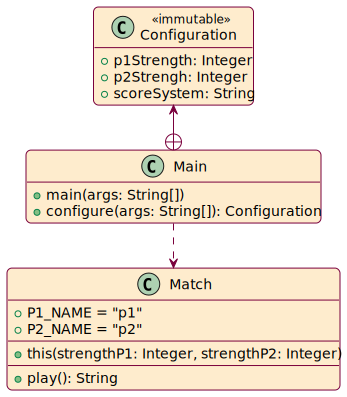
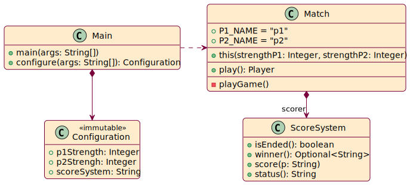
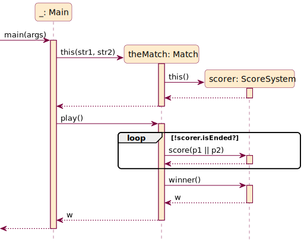
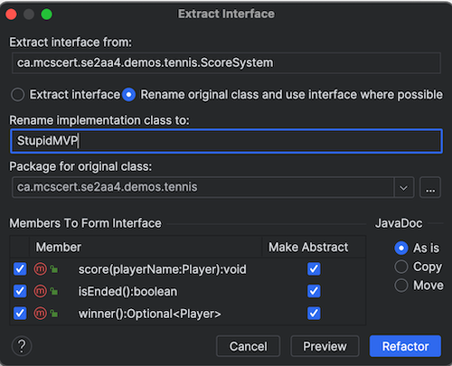

# Driver for Tennis Counting Demo

To get the code ready for demo:

```
mosser@azrael 2aa4-tennis % git checkout demo_step_0
```

Look at the repository:

- `README.md`: description of the project, and how to build and run it
- `LICENSE.txt`: under which condition can one reuse this project?
- `.gitignore`: what _NOT_ to record in the version control system
- `pom.xml`: building and packaging configuration, as well as dependency management and metadata
- `.github/workflows/build.yaml`: continuous integration pipeline to build and package the product each time we push to GitHub.
- `src`: the source code. (Remember: software engineering is not all about coding, even if coding is essential).

## Step #1: Fix the starter code structure

1. Create an  _immutable_ concept for `Configuration` inside `Main`


```
private record Configuration(Integer p1Strength, Integer p2Strength) {
    Configuration { 
        if (p1Strength < 0 || p1Strength > 100)
            throw  new IllegalArgumentException("P1's Strength not in [0,100]: " + p1Strength);
        if (p2Strength < 0 || p2Strength > 100)
            throw  new IllegalArgumentException("P2's Strength not in [0,100]: " + p2Strength);
    }
}
```

2. Extract the configuration code into a dedicated (private) method in `Main`

```
private static Configuration configure(String[] commandLineArguments) throws ParseException {
    Options options = new Options();
    options.addOption("p1", true, "Strength of Player 1 in [0,100]");
    options.addOption("p2", true, "Strength of Player 2 in [0,100]");
    CommandLineParser parser = new DefaultParser();
    CommandLine cmd = parser.parse(options, commandLineArguments);
    Integer p1 = Integer.parseInt(cmd.getOptionValue("p1","50"));
    Integer p2 = Integer.parseInt(cmd.getOptionValue("p2","50"));
    return new Configuration(p1, p2, system);
}
```

3. Modify `Main::main` to use this method

```
public static void main(String[] args) {
    try {
        Configuration config = configure(args);
        System.out.println(config);
        Match theMatch =
                new Match(config.p1Strength(), config.p2Strength());
        String winner = theMatch.play();
        System.out.println("==>> Winner: " + winner);
    } catch (Exception e) {
        System.err.println(e.getMessage());
        e.printStackTrace();
        System.exit(1);
    }
}
```

4. Use the IDE completion mechanisms to create `Match` and the missing method

```
public class Match {

    public static String P1_NAME = "p1";
    public static String P2_NAME = "p2";

    public Match(Integer integer, Integer integer1) { }

    public String play() {
        return "No winner yet!";
    }

}
```

We can now compile, try it out, commit and share.

```
mosser@azrael 2aa4-tennis % mvn -q clean package
mosser@azrael 2aa4-tennis % java -jar target/tennis.jar -p1 20 -p2 78
Configuration[p1Strength=20, p2Strength=78]
No winner yet!
mosser@azrael 2aa4-tennis % git status
On branch demo
Changes to be committed:
  (use "git restore --staged <file>..." to unstage)
        new file:   src/main/java/ca/mcscert/se2aa4/demos/tennis/Match.java

Changes not staged for commit:
  (use "git add <file>..." to update what will be committed)
  (use "git restore <file>..." to discard changes in working directory)
        modified:   src/main/java/ca/mcscert/se2aa4/demos/tennis/Main.java
        modified:   src/main/java/ca/mcscert/se2aa4/demos/tennis/Match.java

mosser@azrael 2aa4-tennis % git add -A
mosser@azrael 2aa4-tennis % git commit -m "first refactoring to move from starter to walking skeleton"
...
mosser@azrael 2aa4-tennis % git tag "demo_step_01"
mosser@azrael 2aa4-tennis % git push --tags origin demo
```

What we've done here is a _refactoring_. We have not added any new feature in the code. We have changed the structure so that it is better from a technical point of view.

### UML Model(s)

<div align="center">




</div>

## Step #2: Create the MVP
 
We need a `ScorerSystem`, to: 

- Score a point: `ScoreSystem::score(String playerName)`
- Know if the game has ended: `ScoreSystem::isEnded() -> Boolean`
- Get the winner: `ScoreSystem::winner() -> Optional<String>`


1. Create the class `ScoreSystem`, with the three methods.

```
public class ScoreSystem {

    public void score(String playerName) { }

    public boolean isEnded() { return false; }

    public Optional<String> winner() { return Optional.empty(); }

}
```


2. Implement the business logic in `Match::play`

```    
public String play() {
    ScoreSystem scorer = new ScoreSystem();
    while(! scorer.isEnded()) {
        String who = decideGameWinner();
        scorer.score(who);
    }
    return scorer.winner()
             .orElseThrow(() -> new IllegalStateException("No Winner!"));
}
```

3. Create the private `Match::decideGameWinner` helper.
    - Player one will always win. That's unfair. Life is unfair.

```
private String decideGameWinner() {
    System.out.println("Winning this game: " + P1_NAME);
    return P1_NAME;
}
```

4. Implement a minimalistic business logic in the `ScoreSystem`

```
public class ScoreSystem {

    private String winner = null;

    public void score(String playerName) {
        this.winner = playerName;
    }

    public boolean isEnded() {
        return winner != null;
    }

    public Optional<String> winner() {
        return (isEnded()? Optional.of(winner): Optional.empty());
    }

}
```

We can now compile, try it out, commit and share.

```
mosser@azrael puml % git status 
On branch demo
Changes to be committed:
  (use "git restore --staged <file>..." to unstage)
        new file:   src/main/java/ca/mcscert/se2aa4/demos/tennis/ScoreSystem.java

Changes not staged for commit:
  (use "git add <file>..." to update what will be committed)
  (use "git restore <file>..." to discard changes in working directory)
        modified:   src/main/java/ca/mcscert/se2aa4/demos/tennis/Match.java
        modified:   src/main/java/ca/mcscert/se2aa4/demos/tennis/ScoreSystem.java
mosser@azrael 2aa4-tennis % git add -A
mosser@azrael 2aa4-tennis % git commit -m "minimal & viable product (assuming P1 always win)"
...
mosser@azrael 2aa4-tennis % git tag demo_step_02
mosser@azrael 2aa4-tennis % git push --tags origin demo
...
mosser@azrael 2aa4-tennis %
```

We have pushed our first version of the tennis counter.

- It is **minimal** because it operates under the assumption that the first player always win a game, and, as such, always wins the match.
- It is **viable** because it contains the right abstraction that will allow us to incrementally enrich it later on: we now have in our backlog to implement a better `ScoreSystem`, and to do a better job in `Match::decideGameWinner`.

### UML model(s)

<div align="center">




</div>

## Step 3: Refactoring (Player and ScoreSystem)

Our code has real technical debt: 

1. We've totally forgotten the notion of `Player`. Strings are not good abstractions to model what a player is.
2. The `ScoreSystem` is a variation point, and, as such, should allow the extension of the code easily. We do need an interface for this.

### First things first: Introducing Player

This one is the most invasive one. We must rip that band-aid. Quickly.

We'll start from the Entry point (`Main::main`) and unroll it.

1. In `Main::main`:
    - update the call to `Match::play()`: `Player winner = theMatch.play();`
2. Create the `Player` class.
    - So far, it only has the requirement of being _printable_. 
    - So we'll give a player a name to be sure we have something to print.

```
public class Player {

    private final String name;

    public Player(String name) { this.name = name; }

    @Override
    public String toString() {
        return "Player " + name;
    }

}
```

3. The code does not compile. We need to update `Match::play`'s signature
    - `public Player play()`
4. The code still does not compile. We need to update the `ScoreSystem::winner` method's signature
    - Wait. Actually the whole `ScoreSystem` would benefit to rely on `Player` instead of Strings. We'll update the whole interface once and for all.

```
public class ScoreSystem {

    private Player winner = null;

    public void score(Player playerName) {
        this.winner = playerName;
    }

    public boolean isEnded() {
        return winner != null;
    }

    public Optional<Player> winner() {
        return (isEnded()? Optional.of(winner): Optional.empty());
    }

}
```

Damn it, still does not compile. 

5. We need to update the `Match` class to also create players, and use them!
    - Principally in the `Match::decideGameWinner` method

```
private Player decideGameWinner() {
    System.out.println("Winning this game: " + P1_NAME);
    return new Player(P1_NAME);
}
```

6. It still does not compile. The game loop needs to be updated.

```
while(! scorer.isEnded()) {
    Player who = decideGameWinner();
    scorer.score(who);
}
```

Let's assess this refactor, check we have not broken anything (soon we'll have tests to do this for us):

```
mosser@azrael 2aa4-tennis % mvn -q clean package   
mosser@azrael 2aa4-tennis % java -jar target/tennis.jar -p1 20 -p2 78                        
Configuration[p1Strength=20, p2Strength=78]
Winning this game: p1
Player p1
```

We can add, and commit. No need to push yet, we have not finished our refactoring effort.

```
mosser@azrael 2aa4-tennis % git status
On branch demo
Changes to be committed:
  (use "git restore --staged <file>..." to unstage)
        new file:   src/main/java/ca/mcscert/se2aa4/demos/tennis/Player.java

Changes not staged for commit:
  (use "git add <file>..." to update what will be committed)
  (use "git restore <file>..." to discard changes in working directory)
        modified:   src/main/java/ca/mcscert/se2aa4/demos/tennis/Main.java
        modified:   src/main/java/ca/mcscert/se2aa4/demos/tennis/Match.java
        modified:   src/main/java/ca/mcscert/se2aa4/demos/tennis/Player.java
        modified:   src/main/java/ca/mcscert/se2aa4/demos/tennis/ScoreSystem.java

mosser@azrael 2aa4-tennis % git add -A
mosser@azrael 2aa4-tennis % git commit -m "introduce player abstraction"
[demo 766222d] introduce player abstraction
 5 files changed, 135 insertions(+), 13 deletions(-)
 create mode 100644 src/main/java/ca/mcscert/se2aa4/demos/tennis/Player.java
mosser@azrael 2aa4-tennis % 
```


## Let's now introduce a `ScoreSystem` interface

We can use the _refactoring_ tooling from IntelliJ!

1. Click on the _Refactor_ menu, _Extract/Introduce..._, and then _Interface..._
    - Extracting interface is a really common refactoring operation.
2. Tell IntelliJ what you want to do:
    - We want to extract the methods into an interface
    - We want to rename the current implementation as `StupidMVP`

<div align="center">



</div>

And... that's it.

3. Look how IntelliJ has refactored the instantiation in `Match::play`:
    - `ScoreSystem scorer = new StupidMVP();`
    - This is how we obtain flexibility: the variable is a `ScoreSystem`, so whatever concrete object we're using, an instance of `StupidMVP` or a `SuperSmartCounter`, as long as it implement `ScoreSystem`, we have nothing to change in our code!


Let's assess this refactor, check we have not broken anything.

```
mosser@azrael 2aa4-tennis % mvn -q clean package                        
mosser@azrael 2aa4-tennis % java -jar target/tennis.jar -p1 20 -p2 78   
Configuration[p1Strength=20, p2Strength=78]
Winning this game: p1
Player p1
mosser@azrael 2aa4-tennis % 
```

We can now add, commit, and finally push the refactored design!

```
mosser@azrael 2aa4-tennis % git status  
On branch demo
Changes to be committed:
  (use "git restore --staged <file>..." to unstage)
        new file:   src/main/java/ca/mcscert/se2aa4/demos/tennis/StupidMVP.java

Changes not staged for commit:
  (use "git add <file>..." to update what will be committed)
  (use "git restore <file>..." to discard changes in working directory)
        modified:   src/main/java/ca/mcscert/se2aa4/demos/tennis/Match.java
        modified:   src/main/java/ca/mcscert/se2aa4/demos/tennis/ScoreSystem.java
        modified:   src/main/java/ca/mcscert/se2aa4/demos/tennis/StupidMVP.java

mosser@azrael 2aa4-tennis % git add -A
mosser@azrael 2aa4-tennis % git commit -m "refactor: introduce abstraction for ScoreSystem"
...
mosser@azrael 2aa4-tennis % git tag demo_step_03
mosser@azrael 2aa4-tennis % git push --tags
...
mosser@azrael 2aa4-tennis %  
```

And we are done!

### UML Model

<div align="center">


</div>

## Out of scope: Implementing Counting Algorithms

Look at the `solution` branch to get two different implementations of the counting algorithm!

